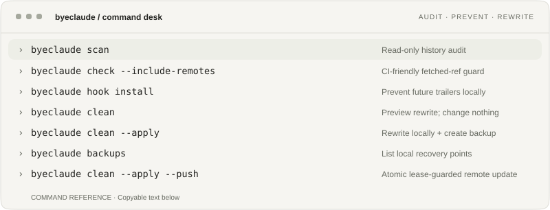

<p align="center">
  <picture>
    <source media="(prefers-color-scheme: dark)" srcset="assets/brand/byeclaude-logo-dark.webp">
    
  </picture>
</p>

<h1 align="center">Audit declared AI attribution. Clean Git history safely.</h1>

<p align="center">Scan one repo or an account, measure declared co-author evidence, preview rewrite impact, and sanitize only when you explicitly ask.</p>

<p align="center">
  <a href="#30-second-flow"></a>
  <a href="#safety-first"></a>
  <a href="#install"></a>
  <a href="LICENSE"></a>
</p>

<p align="center"><a href="#30-second-flow">Quick start</a> · <a href="#keep-it-clean">Keep it clean</a> · <a href="#what-the-rewrite-changes">Rewrite model</a> · <a href="#safety-first">Safety</a> · <a href="#install">Install</a> · <a href="docs/README.md">Docs</a></p>

Claude Code can add a `Co-Authored-By: Claude … <noreply@anthropic.com>` trailer to a commit. GitHub recognizes `Co-authored-by` trailers as additional authors, so that attribution can surface in repository history and contributor data.

**ByeClaude** is a Git-aware attribution auditor and history sanitizer. Claude/Anthropic is the built-in default; validated rule sets can classify several declared co-author identities without turning the rewrite engine into an arbitrary regex tool.

## Why use it?

The tool is for cases where the repository owner has deliberately decided that AI-tool co-author trailers should not remain part of the published Git history. Common reasons include repository hygiene, contributor-graph accuracy, a customer delivery requirement, an internal attribution policy, or simple personal preference.

ByeClaude does **not** decide whether removing attribution is appropriate for a project, and it does not claim that a matching trailer proves how much code an AI produced. It gives the repository owner a narrow, reviewable mechanism for inspecting and changing Git metadata.

| You want to… | ByeClaude does… |
| --- | --- |
| Audit declared AI/tool co-authors | Scans every commit reachable from local heads, tags and `HEAD`, using the Claude default or a validated rule set. |
| Audit several repositories or an account | Read-only batch scan by explicit repo, public/private/all scope, with bounded concurrency and timing metrics by default. |
| Remove them | Rewrites matching commit messages and the descendants whose parent IDs must change. File trees stay untouched. |
| Keep them from coming back | Installs a conservative `commit-msg` hook and ships a read-only GitHub Actions guard. |
| Avoid clobbering shared work | Creates local backup refs, blocks unsafe repository states, and uses atomic force-with-lease for remote updates. |

## 30-second flow

Start read-only:

```sh
byeclaude scan
```

```text
repository  /work/project
commits     184
matched     2 (1.09%)
trailers    2
duration    184ms
  8a51b8b9dbd1  [claude-anthropic] Claude Opus 4.8 <noreply@anthropic.com>
  c0b7bd296ec4  [claude-anthropic] Claude Sonnet 4 <noreply@anthropic.com>
```

Nothing changed. See the actual rewrite impact before touching history:

```sh
byeclaude plan
```

`plan` reports matched commits, descendants that would get new IDs, parent links to reconnect, affected branch/tag refs, annotated tags, signatures at risk and an approximate number of new Git objects. It is read-only.

When you are ready, rewrite locally:

> [!WARNING]
> **Signed commits/tags that must be rewritten cannot keep their old valid signatures.** A signature covers the original Git object bytes. ByeClaude reports dropped signature fields, but it cannot make the old signature valid on the new object. If preserving signed history matters more than removing attribution, stop here. [Details](docs/safety.md#signatures).

```sh
byeclaude clean --apply
```

ByeClaude creates a local backup, records the exact rewritten ref tips, rewrites the necessary commit DAG, updates local heads/tags in one ref transaction, then rescans the result. The command prints the backup ID.

Review the graph and working tree. Then publish exactly that recorded rewrite:

```sh
git log --oneline --decorate --graph --all --max-count=40
byeclaude push --backup BACKUP_ID
```

The reviewed push fails if a local ref moved after the rewrite or if a collaborator moved the remote ref you are about to replace. A remote rewrite changes commit IDs for everyone using those refs.

> [!TIP]
> `byeclaude clean --apply --push` remains available as a one-shot shortcut when you deliberately do not need an inspection gap between rewrite and publish.

## It scans more than the current branch

`byeclaude scan` audits commits reachable from:

- every local branch under `refs/heads/*`;
- every local tag under `refs/tags/*`;
- the current `HEAD`, including detached `HEAD` during read-only audit.

Add fetched remote-tracking refs when you want a wider audit:

```sh
byeclaude scan --include-remotes
```

For scripts and CI, `check` performs the same audit but exits non-zero when a match exists:

```sh
byeclaude check --include-remotes
```

Dangling objects, unfetched GitHub-internal PR refs and external forks are not silently treated as rewrite targets. [Exact scope](docs/how-it-works.md#what-is-and-is-not-scanned).


## Audit many repositories

Batch mode is deliberately **read-only** in this alpha. It can discover repositories, create temporary metadata-only mirrors, scan them concurrently and report per-repository plus aggregate metrics. It cannot account-wide force-push.

A specific GitHub repository:

```sh
byeclaude batch scan --repo IamAngusU/ContextBridge
```

Several explicit repositories:

```sh
byeclaude batch scan \
  --repo IamAngusU/ContextBridge \
  --repo IamAngusU/ByeClaude
```

All public repositories owned by an account:

```sh
byeclaude batch scan --owner IamAngusU --public
```

Private repositories, or public + private together, use `GH_TOKEN` or `GITHUB_TOKEN`:

```sh
GH_TOKEN=... byeclaude batch scan --owner IamAngusU --private
GH_TOKEN=... byeclaude batch scan --owner IamAngusU --all
```

With a token, omit `--owner` to use the authenticated GitHub login:

```sh
GH_TOKEN=... byeclaude batch scan --all
```

`--repo` also accepts clone URLs and existing local repository paths. Public GitHub slugs need no token. ByeClaude intentionally has no `--token` flag, so a credential does not need to be put in shell history.

Normal batch output measures **prepare / mirror time, Git scan time and total time per repository**, then reports wall time, summed prepare/scan time, repositories scanned/clean/matched/failed, total reachable commits and total matching trailers. Parallelism defaults to `min(CPU, 4)` and can be changed with `--jobs 1..32`.

```text
summary     6 scanned · 2 clean · 4 with matches · 0 failed
history     16 commits · 4 matched commits (25.00%) · 4 matching trailers
timing      32ms wall · <1ms prepare sum · 97ms scan sum
```

Those timings are from the small local fixture suite and are not a performance claim. Use `--json` for stable millisecond fields, or `batch check` when matches should make CI fail.

Remote batch scans use temporary `--mirror --filter=blob:none` clones and delete the workspace afterwards. The current alpha deliberately has no persistent mirror cache.

A dated local default-batch sanity run scanned **8 repositories / 4,000 synthetic commits in 1.44 s wall time** with about **12.6 MiB peak RSS** using 4 workers. It excludes network clone time and is not an SLA.

The newer persistent Git object reader also scanned a **5,000-commit synthetic repository in ~0.26 s** and produced the full rewrite plan in **~0.29 s** on the same development host class. These are local Git-metadata measurements, not network latency promises. [Methodology and caveats](docs/performance.md#default-batch-development-measurement).


### Why these benchmarks are not an SLA

That is not a speed warning. ByeClaude is currently a local alpha CLI, not a hosted service with a contractual uptime, latency, support or compatibility commitment. The benchmark numbers are reproducible development measurements on named hardware. A future hosted ByeClaude API could define an SLA separately once its worker pool, caching, quotas and operating environment are known.

Need the cost of a possible rewrite without changing anything?

```sh
byeclaude batch plan --repo owner/repository
byeclaude serve --listen 127.0.0.1:8080
```

That uses the temporary mirror to calculate rewrite impact, including descendant commits, parent-link reconnections, refs, tag objects, signature risk and estimated object writes. [Planning metrics](docs/planning.md).

[Batch selection, authentication and metrics](docs/batch.md) · [Disposable fixture repositories](docs/fixtures.md).

## Watch several AI/tool identities

The default remains deliberately narrow: Claude + the `anthropic.com` email domain.

For several declared co-author identities at once, use a structured rules file instead of an arbitrary regex:

```sh
byeclaude scan --rules ./rules.json
byeclaude batch scan --owner IamAngusU --public --rules ./rules.json
```

The same rules can enforce future local commits:

```sh
byeclaude hook install --rules ./rules.json
```

and can be used for one reviewed rewrite:

```sh
byeclaude clean --rules ./rules.json --apply
byeclaude push --rules ./rules.json --backup BACKUP_ID
```

An example multi-tool ruleset is in [`examples/rules/multi-ai.example.json`](examples/rules/multi-ai.example.json). The schema is intentionally structured and validated; no arbitrary regular expression is executed. Provider attribution formats can change, so review the rules against the actual trailers you want to classify. [Rule format and semantics](docs/rules.md).

## Keep it clean

### Local commits

```sh
byeclaude hook install
```

The installed `commit-msg` hook removes only co-author trailers matching the active rule set before the commit is created. Without `--rules`, that means the built-in Claude/Anthropic rule. Other co-authors remain intact.

ByeClaude refuses to overwrite an unrelated existing `commit-msg` hook. It also refuses installation when `core.hooksPath` points somewhere else instead of pretending a hook was installed successfully.

Remove only the hook owned by ByeClaude:

```sh
byeclaude hook remove
```

### GitHub Actions

Use the repository itself as a read-only attribution guard:

```yaml
name: ByeClaude

on:
  push:
  pull_request:

permissions:
  contents: read

jobs:
  attribution:
    runs-on: ubuntu-latest
    steps:
      - uses: actions/checkout@v4
        with:
          fetch-depth: 0
      - uses: IamAngusU/ByeClaude@main
```

Until the first tagged release exists, the example follows `main`. After a release, pin to a release tag or exact commit SHA. The action checks reachable history and fails CI when the trailer appears. It **does not** rewrite or force-push from CI.

For old quiet branches as well as active PRs, add a scheduled run. [CI and hook guide](docs/automation.md).

## What the rewrite changes

A Git commit ID covers the commit message and its parent IDs. Removing one trailer changes that commit ID. Every descendant must then point at the new parent ID, which changes those descendant IDs too.

That is why this cannot be a cosmetic GitHub toggle.

| Commit property | ByeClaude behavior |
| --- | --- |
| File tree | Preserved exactly. |
| Author / committer | Preserved. |
| Author / committer timestamps | Preserved. |
| Merge parent order | Preserved. |
| Commit message | Only co-author trailers matching the active rule set are removed. |
| Descendant IDs | Rewritten when a parent ID changed. |
| Signed rewritten objects | Signature fields are removed because the original signature cannot remain valid. |
| Annotated tags | Retargeted when needed; an embedded signature is removed if the tag object itself changes. |

The matcher is intentionally narrow. A prose mention of Claude is untouched. So is `Co-authored-by: Claude Shannon <shannon@example.org>`.

[Read the rewrite algorithm](docs/how-it-works.md).

## Safety first

History rewriting is a coordination event, so the dangerous cases fail closed.

Before `--apply`, ByeClaude blocks a rewrite when it sees a shallow repository, dirty working tree, detached `HEAD`, active replace refs, Git notes, multiple linked worktrees, or an in-progress merge/rebase/cherry-pick/revert/bisect/sequencer operation.

During a rewrite it:

1. creates local backup refs before moving normal refs;
2. writes new commit objects without touching file trees;
3. updates heads and tags in one ref transaction;
4. verifies that the matching trailers are gone;
5. leaves GitHub unchanged unless `--push` was requested.

After local review, `byeclaude push --backup BACKUP_ID` binds publication to the old ref tips and the exact rewrite result recorded by that operation. If your local ref moved after review, ByeClaude refuses to publish it.

A built-in remote update only touches refs that already exist on the selected remote. It uses an **atomic push** plus an explicit **force-with-lease** expectation for every changed remote ref. If somebody moved a branch after your local copy, Git rejects the update instead of letting ByeClaude overwrite their work.

```sh
byeclaude backups
byeclaude restore --backup BACKUP_ID --apply
```

Restore is local only. It never republishes the old history for you.

[Safety and recovery](docs/safety.md).

## Run a public demo

ByeClaude now includes a small **read-only web demo**:

```sh
byeclaude serve
```

Open `http://127.0.0.1:8080`, enter a public GitHub `owner/repository`, then choose **Scan** or **Plan cleanup**. The embedded UI calls the same attribution/batch engine as the CLI.

The server deliberately accepts no arbitrary clone URL, no browser-supplied GitHub token and exposes no cleanup/push endpoint. It bounds concurrent audits and applies a per-job timeout. A Dockerfile and Caddy example are included for VPS deployment. [Public VPS demo](docs/demo-server.md).

## Use it, don't fork it

Most users do **not** need to fork ByeClaude.

During the alpha before the first tagged release, the shortest path is:

```sh
go install github.com/IamAngusU/ByeClaude/cmd/byeclaude@main
```

After the first alpha release, the preferred path will be the published release binary / checksum-verifying installer. A fork only makes sense when you want to change the engine itself or maintain your own product variant. Multi-provider attribution does not require a fork; use `--rules FILE`.

For continuous repository enforcement, use the GitHub Action in addition to the local CLI. The local hook protects one developer's commits; a required CI check can protect the shared branch from commits that bypass local hooks.

## Install

### Go / source

Requires Git and Go 1.23+:

```sh
go install github.com/IamAngusU/ByeClaude/cmd/byeclaude@main
```

Or build the checked-out source:

```sh
git clone https://github.com/IamAngusU/ByeClaude.git
cd ByeClaude
go test ./...
go build -o byeclaude ./cmd/byeclaude
```

### Release installers

Tagged releases are configured to publish checksum-verified binaries for Linux, macOS and Windows on amd64 and arm64. The installer URLs below become usable once the first tagged release exists.

<details>
<summary><strong>Installer commands</strong></summary>

Linux / macOS:

```sh
curl -fsSL https://raw.githubusercontent.com/IamAngusU/ByeClaude/main/install.sh | sh
```

Windows PowerShell:

```powershell
irm https://raw.githubusercontent.com/IamAngusU/ByeClaude/main/install.ps1 | iex
```

Both installers download the matching asset from `releases/latest` and verify it against the published SHA-256 checksum file before installation.

</details>

## Command desk

<p align="center">
  <picture>
    <source media="(max-width: 600px)" srcset="docs/assets/readme/command-desk-mobile.svg">
    
  </picture>
</p>

<details>
<summary><strong>Copy commands and recovery path</strong></summary>

```sh
byeclaude scan
byeclaude plan
byeclaude check --include-remotes
byeclaude batch scan --owner IamAngusU --public
byeclaude batch plan --repo owner/repository
byeclaude hook install
byeclaude clean
byeclaude clean --apply
byeclaude backups
byeclaude restore --backup ID --apply
byeclaude push --backup ID
```

| Intent | Behavior |
| --- | --- |
| `scan` | Read-only audit of reachable local history. |
| `plan` | Read-only rewrite-impact graph: descendants, parent links, refs, tags, signatures and object-write estimate. |
| `check --include-remotes` | CI-friendly audit including fetched remote-tracking refs. |
| `batch scan` | Read-only audit of explicit repos or public/private/all GitHub owner scopes, with metrics by default. |
| `batch plan` | Run the same read-only rewrite-impact calculation across remote/local repository targets. |
| `serve` | Start the public-repo-only read-only demo UI/API with bounded concurrency and timeouts. |
| `hook install` | Prevent matching trailers in future local commits. |
| `clean` | Preview only; no refs move. |
| `clean --apply` | Rewrite locally after preflight checks and create backup refs. |
| `restore --backup ID --apply` | Restore local heads/tags from a ByeClaude backup. |
| `push --backup ID` | Publish exactly the recorded, reviewed rewrite with atomic force-with-lease. |

Every command accepts `--repo PATH` where applicable. `clean --apply --push` is still available as a one-shot rewrite-and-publish shortcut. Otherwise GitHub stays untouched until the explicit `push` command.

</details>

## JSON as a backend/API building block

`scan --json` and `batch scan --json` now expose the pieces a later website/API needs: total commits, unique matched commits, matched-commit percentage, declared co-author identity, matching rule IDs, per-rule counts, repository-match percentage and timing metrics.

That supports statements such as **"4.05% of reachable commits carry declared attribution matching these rules"**. It does **not** support **"4.05% of the code was written by AI"**. A trailer says nothing about how many lines were produced.

A future AI/style/slop scanner should therefore be a separate heuristic evidence layer with its own detector name and confidence. [Evidence model](docs/evidence.md) · [Service/API boundary](docs/service.md).

## Scope and limitations

ByeClaude cleans **Git commit attribution**. It does not edit pull-request text, issues, comments, external forks, GitHub caches, or repository objects you never fetched.

Internally, the Git DAG rewriter is matcher-agnostic; Claude/Anthropic remains the built-in default, while validated structured `--rules` files can classify several declared co-author identities without exposing arbitrary history-rewrite regexes. [Matching architecture](docs/matching.md).

GitHub contributor statistics can lag behind a force-push or rewritten default branch. Old commit IDs may also remain referenced by forks, pull requests, caches or other clones even after your normal branches are clean.

This is pre-1.0 software. The repository includes integration coverage for linear and merge histories, branches, tags, backups/restores, remote lease races, atomic push behavior, shallow clones, worktrees, replace refs, notes, SHA-256 repositories, custom attribution matchers and batch aggregation. A six-repository disposable fixture suite exercises the real batch CLI. Platform CI is configured to run the Go test suite on Linux, macOS and Windows, with the race detector additionally exercised on Linux.

## Documentation

- [How the rewrite works](docs/how-it-works.md)
- [Matching architecture](docs/matching.md)
- [Multiple attribution rules](docs/rules.md)
- [Evidence model](docs/evidence.md)
- [Service/API integration](docs/service.md)
- [Public VPS demo](docs/demo-server.md)
- [Rewrite planning](docs/planning.md)
- [Batch repository audit](docs/batch.md)
- [Fixture repository suite](docs/fixtures.md)
- [Safety, backups and recovery](docs/safety.md)
- [Hooks and GitHub Actions](docs/automation.md)
- [Troubleshooting](docs/troubleshooting.md)
- [Synthetic history benchmark](docs/performance.md)
- [Contributing](CONTRIBUTING.md)
- [Security policy](SECURITY.md)

## License

MIT. See [LICENSE](LICENSE). [Trademarks and third-party names](TRADEMARKS.md).

<p align="center"><sub>ByeClaude is an independent open-source project and is not affiliated with Anthropic.</sub></p>
