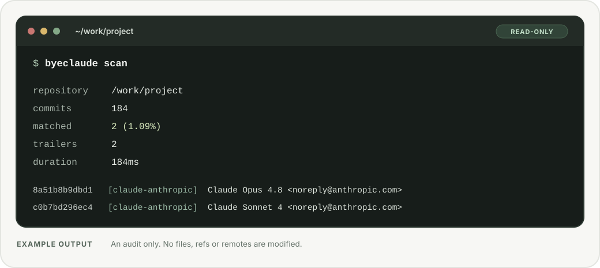

<p align="center">
  <picture>
    <source media="(prefers-color-scheme: dark)" srcset="assets/brand/byeclaude-logo-dark.webp">
    
  </picture>
</p>

<h1 align="center">Clean unwanted AI co-author attribution from Git history.</h1>

<p align="center">Find matching commit trailers. Preview the impact. Rewrite only when you choose to.</p>

<p align="center">
  <a href="#quick-start"></a>
  <a href="#safety-first"></a>
  <a href="#quick-start"></a>
  <a href="LICENSE"></a>
</p>

<p align="center"><a href="#quick-start">Quick start</a> · <a href="#what-changes">Before / after</a> · <a href="#safety-first">Safety</a> · <a href="docs/README.md">Documentation</a> · <a href="https://github.com/IamAngusU/ByeClaude/releases">Releases</a></p>

Claude Code can append `Co-Authored-By: Claude <noreply@anthropic.com>` to Git commits. GitHub recognizes these trailers as additional contributor attribution. **ByeClaude** audits that *declared metadata* and lets repository owners remove matching trailers without changing the committed file trees.

Claude/Anthropic is the built-in rule. [Validated rule sets](docs/rules.md) can match other declared tool identities too.

## What changes?

<p align="center">
  
</p>

**Only matching co-author trailers are removed from the message.** Rewriting a commit changes its ID, so reachable descendants and affected branch or tag references may also need new IDs. [See how rewriting works](docs/how-it-works.md).

## Quick start

**Install:** Get a [checksum-verified release for Windows, macOS or Linux](https://github.com/IamAngusU/ByeClaude/releases/tag/v0.1.0-alpha.1), or install the current alpha using Go 1.27+:

```sh
go install github.com/IamAngusU/ByeClaude/cmd/byeclaude@v0.1.0-alpha.1
```

Git is required. See [installation options and integrity notes](docs/supply-chain.md).

In a **local Git repository**, start with two read-only commands:

```sh
byeclaude scan  # find matching declared co-author trailers
byeclaude plan  # preview every commit/ref/tag that would change
```

<p align="center">
  
</p>

`plan` also reports affected descendants, signatures at risk and whether a cleanup is safe to apply. Nothing is rewritten by either command.

### Clean only when you're ready

> [!WARNING]
> Rewriting changes commit IDs and can remove signatures from rewritten commits or tags. Coordinate with collaborators before publishing rewritten history. [Read the safety guide](docs/safety.md).

```sh
byeclaude clean --apply  # rewrite locally and create backup refs
```

Review the result and **save the printed backup ID**. Publishing is a separate, guarded action:

```sh
git log --oneline --decorate --graph --all --max-count=40
byeclaude push --backup BACKUP_ID
```

The push uses an atomic force-with-lease expectation and refuses to overwrite a remote ref that moved after your review. [Backups and recovery](docs/safety.md).

## Other useful commands

| Need | Command |
| --- | --- |
| Prevent matching trailers in future local commits | `byeclaude hook install` |
| Check history in CI | `byeclaude check --include-remotes` |
| Audit all public repositories for an account | `byeclaude batch scan --owner YOUR_NAME --public` |
| Audit additional declared tool identities | `byeclaude scan --rules ./rules.json` |
| Try the local, read-only public-repo web demo | `byeclaude serve` |

Batch operations are **read-only** in this alpha. ByeClaude also includes a [read-only GitHub Action](docs/automation.md) for shared branches.

## Safety first

- **Audit before modifying:** `scan`, `plan` and batch audits do not rewrite history.
- **Reviewable changes:** Local cleanup creates backup refs; publish only the exact rewrite you reviewed.
- **Narrow scope:** File trees are preserved. Only co-author trailers matching the active rules are removed from commit messages.
- **Know the limits:** GitHub PR refs, forks, caches and unfetched objects may still retain old commits; contributor statistics can lag. [Scope and troubleshooting](docs/troubleshooting.md).

A trailer is evidence of *declared attribution*, **not** a measurement of how much code an AI produced. ByeClaude does not attempt to detect AI-written source code. [Evidence model](docs/evidence.md).

## Documentation

[Full documentation](docs/README.md) · [Rewrite model](docs/how-it-works.md) · [Safety and recovery](docs/safety.md) · [Batch scanning](docs/batch.md) · [Rules](docs/rules.md) · [Hooks and CI](docs/automation.md) · [Troubleshooting](docs/troubleshooting.md)

[Contributing](CONTRIBUTING.md) · [Security policy](SECURITY.md) · [MIT license](LICENSE)

<p align="center"><sub>Independent open-source project. Not affiliated with Anthropic. <a href="TRADEMARKS.md">Trademark notes</a>.</sub></p>
