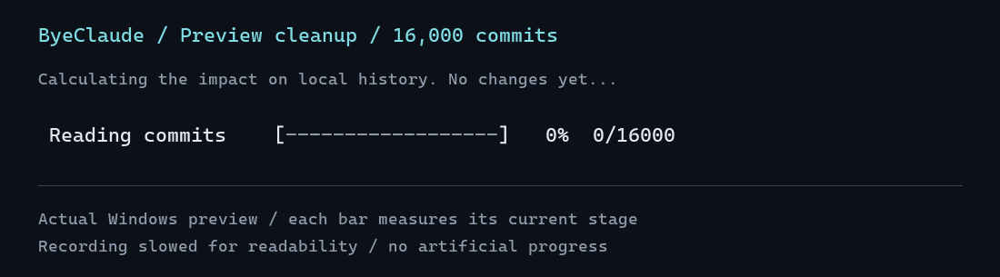

<p align="center">
  <picture>
    <source media="(prefers-color-scheme: dark)" srcset="assets/brand/byeclaude-logo-dark.webp">
    
  </picture>
</p>

<p align="center">
  <a href="README.de.md"></a>
</p>

<h1 align="center">Audit and safely clean unwanted AI co-author credits from Git history.</h1>
<p align="center">Scan first. Preview every rewrite. Keep file contents intact.</p>

<p align="center">
  <a href="#quick-start"></a>
  <a href="#safety-first"></a>
  <a href="#quick-start"></a>
  <a href="LICENSE"></a>
</p>
<p align="center">
  <a href="https://github.com/angusu-de/ByeClaude/actions/workflows/ci.yml"></a>
</p>
<p align="center"><sub>Public CI on a separate account, same maintainer. <a href="https://github.com/angusu-de/ByeClaude/blob/ci-proof/proof/README.md">Tested commit and individual steps</a>. Badge design: IamAngusU/Badges.</sub></p>
<p align="center"><a href="#quick-start">Get started</a> · <a href="#what-changes">What changes?</a> · <a href="#publish-when-ready">Publish</a> · <a href="docs/README.md">Documentation</a> · <a href="https://github.com/IamAngusU/ByeClaude/releases">Releases</a></p>

Some AI tools add a line such as `Co-authored-by: Claude <noreply@anthropic.com>` to a Git commit message. Older Claude Code versions also emitted a final `Generated with Claude Code` marker, and some environments add a `Claude-Session` trailer. ByeClaude gives you control over that declared Git metadata: audit existing history, remove selected credits and prevent them from coming back. Claude/Anthropic is selected by default; a saved blacklist can cover several tool identities.

Despite the name, this is not an anti-AI project and it is not an AI detector. ByeClaude does not guess who wrote code. It only works with declared Git metadata.

I do not use Claude Code in my own day-to-day workflow, so the Claude attribution path is reproduced in disposable test repositories rather than my own history. The rewrite and safety behavior is covered by automated tests and public CI, but feedback from real Claude Code repositories is especially useful.

## Quick start

**Install → guided setup → use Git normally.** You need [Git](https://git-scm.com/downloads), but no Go compiler, administrator rights or GitHub login for local work. Copy **one line** for your platform:

<details open>
<summary><strong>Windows · paste into PowerShell</strong></summary>

```powershell
irm https://raw.githubusercontent.com/IamAngusU/ByeClaude/v0.1.0-alpha.6/install.ps1 | iex
```

</details>

<details>
<summary><strong>macOS / Linux · paste into Bash, Zsh or sh</strong></summary>

```sh
(f="$(mktemp)" && trap 'rm -f -- "$f"' EXIT && curl -fsSL https://raw.githubusercontent.com/IamAngusU/ByeClaude/v0.1.0-alpha.6/install.sh -o "$f" && sh "$f")
```

</details>

The script detects your platform, downloads the release, checks SHA-256, installs in your user folder, configures your user PATH and **opens guided setup in an interactive terminal**. That one pasted command is the complete installation; there is no separate archive, build or PATH step. No UAC or sudo is needed. Git itself is a prerequisite; the installer does not install a package manager or Git for you. [Inspect the Windows script](install.ps1) · [Inspect the Unix script](install.sh) · [Manual download and advanced options](docs/supply-chain.md).

### Set up your repository

Setup starts immediately after installation. Choose a local Git folder if asked, then follow the highlighted step:

1. **Choose identities.** Keep Claude, or add the exact emails of other tools.
2. **Check history.** Review matching credits, authors and committers. This is read-only.
3. **Preview cleanup.** See the impact and backup plan. At the `Type CLEAN` confirmation, **Enter cancels**; **CLEAN** applies locally.
4. **Protect future commits.** Answer **y** to install both local Git hooks; **Enter skips**.

The installer never cleans history or installs Git hooks without these confirmations. A blocked PATH update does not prevent guided setup: the installer starts ByeClaude by its full path. You can retry PATH later.

### Use it

After setup, ordinary `git commit` and `git push` use the installed hooks. The commit hook removes matching co-author credits; the push hook checks history and may block a push until old matches have been reviewed. Hooks apply only to this clone.

To reopen the menu, open a **new terminal** in your project and run:

```text
byeclaude
```

| Want to… | Run |
| --- | --- |
| Repeat guided setup | `byeclaude guide` |
| Check without changing anything | `byeclaude scan` |
| Watch your local activity | `byeclaude metrics --watch` |

Scripts and CI never open the guide. Use `-NoStart` on the downloaded PowerShell installer, `--no-start` on the shell installer, or `BYECLAUDE_NO_START=1` to install without opening it. [PATH options and recovery](docs/supply-chain.md).

Short gray explanations tell you what each choice does. The same words remain visible with `--no-color`. Use **h** for the basics, **q** to leave a form, or **q** at the main menu to exit. Incorrect answers can be corrected; cancelled or incomplete confirmations do not apply the pending change. Previously completed changes remain saved.

The terminal is credited **Powered by angusu.de | Angus Uelsmann**.

Longer scans and previews show the current stage and actual commit progress. Other Git actions show a spinner until they finish.

<details>
<summary>See a real progress bar</summary>


<sub>Actual alpha.5 Windows preview; playback slowed for readability. Each percentage belongs to the named stage. [Transcript](docs/assets/readme/progress-session.txt).</sub>

</details>


<sub>Alpha.3 guided-flow recording in a disposable Windows repository, rendered from its [transcript](docs/assets/readme/terminal-session.txt). Alpha.5 adds the live dashboard and progress indicators shown below.</sub>

## See the work handled for you

Choose **m** in the menu, or run `byeclaude metrics`. A compact dashboard highlights your totals; **w** opens the live view, **d** explains counting, and **e** models your own effort estimate. See removed credits, rewritten commits, automatic commit-message edits and blocked push attempts across your local usage. Counters stay on this computer; no repository names, emails or commit content are collected or uploaded. Recording starts with alpha.4 and can be disabled at any time.

```sh
byeclaude metrics
byeclaude metrics --watch                  # live totals and +changes; Enter returns
byeclaude metrics --details                # counting notes, kept out of the dashboard
byeclaude metrics --seconds-per-credit 30  # your assumption, not measured savings
byeclaude metrics off                     # stop collecting; keep existing totals
byeclaude metrics reset --confirm          # clear counters; Git backups stay intact
```

Repeated scans count as activity, not additional credits removed. Later-undone cleanups remain in activity totals; hook edits can precede a cancelled Git commit. Counter storage is best-effort and never blocks Git work. [What is counted and where it is stored](docs/metrics.md).


<sub>Alpha.5 Windows terminal recording. Real operations in a disposable repository; isolated counters. [Transcript](docs/assets/readme/metrics-session.txt).</sub>

## What changes?

By default, cleanup removes matching `Co-authored-by` lines, exact known Claude Code end markers and the `Claude-Session` trailer. It does not remove the same words when they are quoted in the normal message body. Human credits and unrelated trailers remain. **Committed file contents stay identical.** Actual author/committer correction is an advanced, separate choice.

<p align="center"></p>

Changing a commit also changes its ID and the IDs of affected descendants. Affected signatures cannot remain valid. ByeClaude reports this before applying and keeps local backup refs. [How it works](docs/how-it-works.md).

## Publish when ready

**The menu does not push anything to GitHub.** To publish a reviewed cleanup, open a terminal in that same repository. Coordinate with collaborators first, then run:

```sh
byeclaude push
byeclaude verify
```

`push` selects a backup automatically when exactly one exists. With several backups, use `byeclaude backups`, then `byeclaude push --backup ID`. It refuses changed local refs and uses an atomic force-with-lease to protect newer remote work. `verify` checks current GitHub history and advertised PR refs; it reports incomplete checks explicitly.

To undo a local cleanup, choose **6** for backup IDs and instructions, or run `byeclaude restore --backup ID --apply`. Restore refuses to overwrite later local work. [Safety and recovery](docs/safety.md).

## Common questions

| Situation | What to do |
| --- | --- |
| `byeclaude` is not found | Open a new terminal on Windows; on Unix, check the PATH instruction printed by the installer. You can also run the full installed path. |
| PATH setup was denied or skipped | Use the full executable path with `path setup` to retry. A deferred attempt is offered again at the next interactive start; Later continues normally, and No stops reminders. No administrator access is required. |
| The folder is rejected | Choose an existing local Git clone, not a GitHub URL or a file. Quotes and `~/` paths are accepted. The previous selection is kept if you cancel. |
| Cleanup says the working tree is not clean | Commit or stash your work, then preview again. ByeClaude does not discard it for you. |
| Protection conflicts with another hook | Choose **5**. Existing hooks are preserved; integrate with that hook manager instead of overwriting it. |
| A push is blocked after installing protection | Existing history can still contain matches. Choose **1**, then **3** to review them. Installing hooks alone does not clean old commits. |
| CI fails on an unrelated new change | The full-history Action checks older reachable commits too. Run `byeclaude check --include-remotes` locally before making it required, then review `plan` if it finds historical attribution. |
| The blacklist needs repair | Choose **2**, then **reset**. Review the warning and type `RESET` to restore the Claude default. |
| I want to block several identities | Choose **2** to add each exact email. Existing rules stay selected; default hooks use the updated policy immediately. |

## Safety first

- Audits and previews are read-only. Cleanup and hook installation need separate confirmation.
- A changed repository or policy during review cancels the pending operation. Recovery and publishing protect newer work.
- Backup refs remain local until you verify the remote result and prune one explicitly. `git push --mirror` is blocked while ByeClaude recovery refs are present.
- Hooks apply to this clone. GitHub web/API commits, other clones and deliberately bypassed hooks need separate protection.
- GitHub caches, historical PR objects, forks and other clones may retain old commits. No tool can promise their erasure from this workflow.

ByeClaude checks **declared Git metadata**. It does not detect AI-written code or prove who authored a file. This is prerelease software; the [CI evidence](https://github.com/angusu-de/ByeClaude/blob/ci-proof/proof/README.md) documents tested behavior, not a guarantee against every failure.

## More options

The menu is optional. Scripts can use `scan`, `check`, `plan`, `blacklist`, `setup` and `verify` directly. Batch auditing remains read-only.

[Command reference](docs/cli.md) · [Rules and blacklist](docs/rules.md) · [Hooks and CI](docs/automation.md) · [Batch scanning](docs/batch.md) · [GitHub verification](docs/github-verification.md) · [Identity correction](docs/identity-correction.md) · [Full documentation](docs/README.md)

[Contributing](CONTRIBUTING.md) · [Security policy](SECURITY.md) · [MIT license](LICENSE)
<p align="center"><sub>Powered by <a href="https://angusu.de">angusu.de</a> · Angus Uelsmann. Independent open-source project. Not affiliated with Anthropic. <a href="TRADEMARKS.md">Trademark notes</a>.</sub></p>
