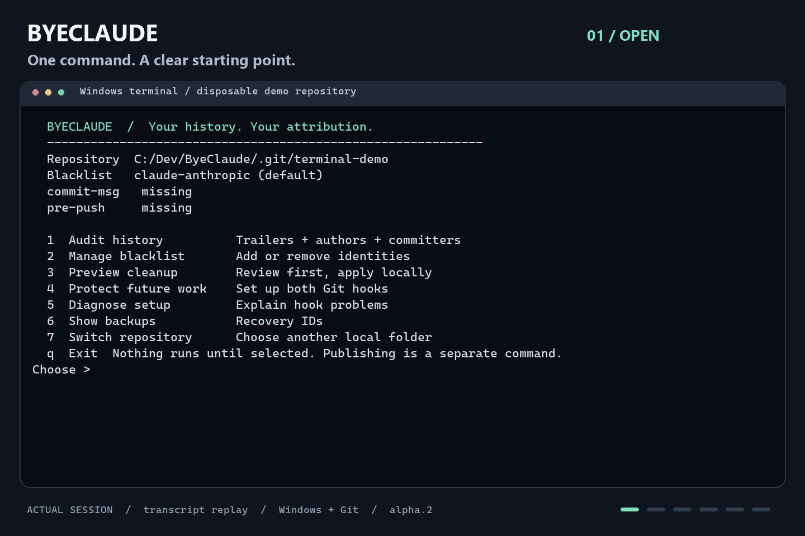
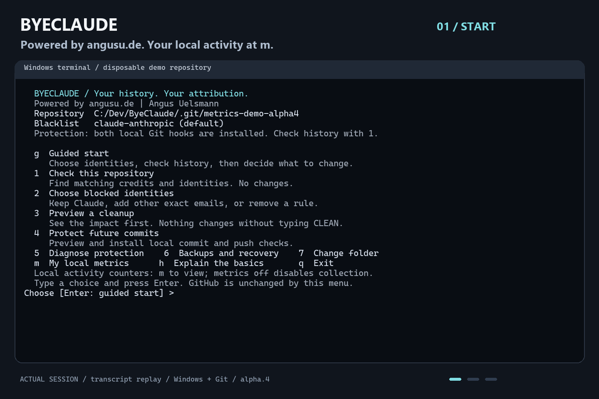
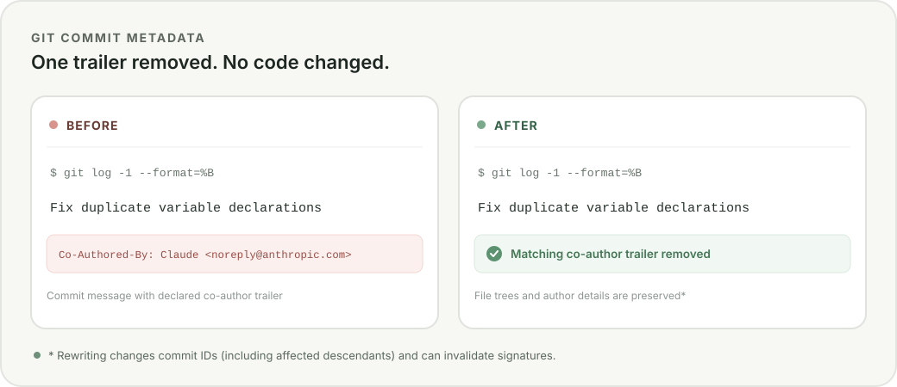

<p align="center">
  <picture>
    <source media="(prefers-color-scheme: dark)" srcset="assets/brand/byeclaude-logo-dark.webp">
    
  </picture>
</p>

<h1 align="center">Remove unwanted co-author credits from Git history.</h1>
<p align="center">Choose the identities. Preview the change. Keep your file contents.</p>

<p align="center">
  <a href="#quick-start"></a>
  <a href="#safety-first"></a>
  <a href="#quick-start"></a>
  <a href="LICENSE"></a>
</p>
<p align="center">
  <a href="https://github.com/angusu-de/ByeClaude/actions/workflows/ci.yml"></a>
</p>
<p align="center"><sub>Public CI on a separate account, same maintainer. <a href="https://github.com/angusu-de/ByeClaude/blob/ci-proof/proof/README.md">Tested commit and individual steps</a>. Badge design: IamAngusU/Badges.</sub></p>
<p align="center"><a href="#quick-start">Get started</a> · <a href="#what-changes">What changes?</a> · <a href="#publish-when-ready">Publish</a> · <a href="docs/README.md">Documentation</a> · <a href="https://github.com/IamAngusU/ByeClaude/releases">Releases</a></p>

Some tools add a line such as `Co-authored-by: Claude <noreply@anthropic.com>` to a Git commit message. ByeClaude finds these declared credits and lets you remove the ones you choose. Claude/Anthropic is selected by default; a saved blacklist can cover several tool identities.

## Quick start

Install [Git](https://git-scm.com/downloads) first. The release binary needs **no Go compiler, admin rights or GitHub login** for local work. Choose your platform:

<details open>
<summary><strong>Windows: run in PowerShell</strong></summary>

```powershell
$installer = Join-Path $env:TEMP 'byeclaude-install.ps1'
Invoke-WebRequest -UseBasicParsing https://raw.githubusercontent.com/IamAngusU/ByeClaude/v0.1.0-alpha.4/install.ps1 -OutFile $installer
powershell -NoProfile -ExecutionPolicy Bypass -File $installer
```

Then open a **new cmd or PowerShell window**. The installer checks the binary's SHA-256 and sets up your user PATH by default, without UAC. A blocked destination falls back to a user folder. If PATH setup fails, the installed binary still works: use the full path printed by the installer and retry on the next interactive start. Use `-NoPath` to manage PATH yourself.

</details>

<details>
<summary><strong>macOS or Linux: run in your terminal</strong></summary>

```sh
installer="$(mktemp)"
curl -fsSL https://raw.githubusercontent.com/IamAngusU/ByeClaude/v0.1.0-alpha.4/install.sh -o "$installer" && sh "$installer"
rm -- "$installer"
```

The installer checks the binary's SHA-256, installs to `~/.local/bin` by default, and adds a marked PATH entry for Bash, Zsh or sh. Open a new terminal afterwards. Existing settings are preserved; a linked/managed profile or unsupported shell leaves PATH setup deferred. The full installed path still works. Set `BYECLAUDE_NO_PATH=1` to manage PATH yourself.

</details>

Prefer a manual install? Download a [release binary](https://github.com/IamAngusU/ByeClaude/releases/tag/v0.1.0-alpha.4). [Installer details, checksums and source builds](docs/supply-chain.md).

Now run:

```text
byeclaude
```

Start inside your Git project, or paste its **local folder path** when asked. Press **Enter for Guided start**:

1. **Choose identities.** Keep Claude selected, or add an exact email from a commit's co-author credit.
2. **Check history.** See matching credits, authors and committers. This changes nothing.
3. **Preview cleanup.** Review affected commits and branches. Enter cancels; typing `CLEAN` applies locally and creates a backup.
4. **Protect future commits.** Review both Git hooks. They are installed only after you answer `y` or `yes`.

Short gray explanations tell you what each choice does. The same words remain visible with `--no-color`. Use **h** for the basics, **q** to leave a form, or **q** at the main menu to exit. Incorrect answers can be corrected; cancelled or incomplete confirmations do not apply the pending change. Previously completed changes remain saved.

The terminal is credited **Powered by angusu.de | Angus Uelsmann**.


<sub>Alpha.3 guided-flow recording in a disposable Windows repository, rendered from its [transcript](docs/assets/readme/terminal-session.txt). Alpha.4 adds the metrics view below.</sub>

## See the work handled for you

Choose **m** in the menu, or run `byeclaude metrics`. See removed credits, rewritten commits, automatic commit-message edits and blocked push attempts across your local usage. Counters stay on this computer; no repository names, emails or commit content are collected or uploaded. Recording starts with alpha.4 and can be disabled at any time.

```sh
byeclaude metrics
byeclaude metrics --seconds-per-credit 30  # your assumption, not measured savings
byeclaude metrics off                     # stop collecting; keep existing totals
byeclaude metrics reset --confirm          # clear counters; Git backups stay intact
```

Repeated scans count as activity, not additional credits removed. Later-undone cleanups remain in activity totals; hook edits can precede a cancelled Git commit. Counter storage is best-effort and never blocks Git work. [What is counted and where it is stored](docs/metrics.md).


<sub>Alpha.4 Windows session, recorded with isolated demo counters. [Transcript](docs/assets/readme/metrics-session.txt).</sub>

## What changes?

By default, cleanup removes only matching `Co-authored-by` lines. Human credits that do not match the blacklist remain. **Committed file contents stay identical.** Actual author/committer correction is an advanced, separate choice.

<p align="center"></p>

Changing a commit also changes its ID and the IDs of affected descendants. Affected signatures cannot remain valid. ByeClaude reports this before applying and keeps local backup refs. [How it works](docs/how-it-works.md).

## Publish when ready

**The menu does not push anything to GitHub.** To publish a reviewed cleanup, open a terminal in that same repository. Coordinate with collaborators first, then run:

```sh
byeclaude push
byeclaude verify
```

`push` selects a backup automatically when exactly one exists. With several backups, use `byeclaude backups`, then `byeclaude push --backup ID`. It refuses changed local refs and uses an atomic force-with-lease to protect newer remote work. `verify` checks current GitHub history and advertised PR refs; it reports incomplete checks explicitly.

To undo a local cleanup, choose **6** for backup IDs and instructions, or run `byeclaude restore --backup ID --apply`. Restore refuses to overwrite later local work. [Safety and recovery](docs/safety.md).

## Common questions

| Situation | What to do |
| --- | --- |
| `byeclaude` is not found | Open a new terminal on Windows; on Unix, check the PATH instruction printed by the installer. You can also run the full installed path. |
| PATH setup was denied or skipped | Use the full executable path with `path setup` to retry. A deferred attempt is offered again at the next interactive start; Later continues normally, and No stops reminders. No administrator access is required. |
| The folder is rejected | Choose an existing local Git clone, not a GitHub URL or a file. Quotes and `~/` paths are accepted. The previous selection is kept if you cancel. |
| Cleanup says the working tree is not clean | Commit or stash your work, then preview again. ByeClaude does not discard it for you. |
| Protection conflicts with another hook | Choose **5**. Existing hooks are preserved; integrate with that hook manager instead of overwriting it. |
| A push is blocked after installing protection | Existing history can still contain matches. Choose **1**, then **3** to review them. Installing hooks alone does not clean old commits. |
| The blacklist needs repair | Choose **2**, then **reset**. Review the warning and type `RESET` to restore the Claude default. |
| I want to block several identities | Choose **2** to add each exact email. Existing rules stay selected; default hooks use the updated policy immediately. |

## Safety first

- Audits and previews are read-only. Cleanup and hook installation need separate confirmation.
- A changed repository or policy during review cancels the pending operation. Recovery and publishing protect newer work.
- Hooks apply to this clone. GitHub web/API commits, other clones and deliberately bypassed hooks need separate protection.
- GitHub caches, historical PR objects, forks and other clones may retain old commits. No tool can promise their erasure from this workflow.

ByeClaude checks **declared Git metadata**. It does not detect AI-written code or prove who authored a file. This is prerelease software; the [CI evidence](https://github.com/angusu-de/ByeClaude/blob/ci-proof/proof/README.md) documents tested behavior, not a guarantee against every failure.

## More options

The menu is optional. Scripts can use `scan`, `check`, `plan`, `blacklist`, `setup` and `verify` directly. Batch auditing remains read-only.

[Command reference](docs/cli.md) · [Rules and blacklist](docs/rules.md) · [Hooks and CI](docs/automation.md) · [Batch scanning](docs/batch.md) · [GitHub verification](docs/github-verification.md) · [Identity correction](docs/identity-correction.md) · [Full documentation](docs/README.md)

[Contributing](CONTRIBUTING.md) · [Security policy](SECURITY.md) · [MIT license](LICENSE)
<p align="center"><sub>Powered by <a href="https://angusu.de">angusu.de</a> · Angus Uelsmann. Independent open-source project. Not affiliated with Anthropic. <a href="TRADEMARKS.md">Trademark notes</a>.</sub></p>
